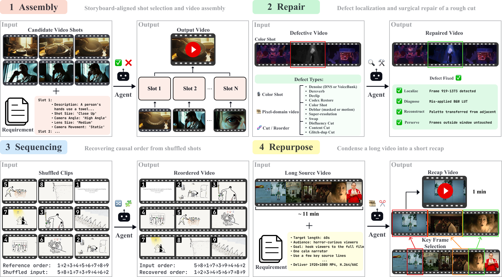

# agentic-vbench

<p align="center">
  
</p>

**AgenticVBench** is a 100-task benchmark for evaluating AI agents on real-world video post-production workflows — **Assembly**, **Repair**, **Sequencing**, and **Repurpose**. Tasks are authored by 20 industry experts (avg. 6 years of professional experience) and scored on a 0–1 scale, mixing programmatic verifiers with rubric-based LLM judges.

Built on [Harbor](https://www.harborframework.com/) — agent installation, sandboxed execution, concurrency, and trial scoring are handled for you.

---

## 📊 What's in the suite

| Family | Count | What the agent does |
|---|---:|---|
| `agentic_vbench_repair` | 18 | Restore a localized corruption (color shift, blur, low-res, swapped object, glitch, content cut, disfluency, or audio defect) in a clip. |
| `agentic_vbench_assembly` | 18 | Pick 4 candidate clips from a pool and place them in the correct slot order to satisfy a prompt. |
| `agentic_vbench_sequencing` | 28 | Re-order a set of shuffled clips into the correct narrative sequence. |
| `agentic_vbench_repurpose` | 36 | Re-cut a long-form source video into a short vertical clip that satisfies a per-task creative brief. |

The `repair`, `assembly`, and `sequencing` families score with deterministic per-family judges and ship a bundled **golden solution** + **broken/random baseline** — by construction the golden scores 1.0 and the baseline scores 0.0. See [`docs/VERIFIER_DESIGN.md`](docs/VERIFIER_DESIGN.md) for the per-family scoring math. The `repurpose` family uses a rubric-based LLM-as-judge against a per-task creative brief (deterministic format checks + Gemini/Opus content judges; same 0–1 reward shape).

---

## 🚀 Quick start

### 1. Install

```bash
git clone https://github.com/PhiloLabs/agentic-vbench.git
cd agentic-vbench
./scripts/install-harbor.sh
python3 -m venv .venv && .venv/bin/pip install --upgrade pip
```

### 2. Run one task with an agent

Pick any agent supported by Harbor (`claude-code`, `codex`, `gemini-cli`, `opencode`, …), export the matching API key, and run via the `./avb` CLI (a thin wrapper that auto-injects per-agent + per-family env vars into `harbor run`):

```bash
# Claude Code (Anthropic):
export ANTHROPIC_API_KEY=...
./avb run exp-codec-restore-task01 -a claude-code -m anthropic/claude-sonnet-4-6

# Codex (OpenAI):
export OPENAI_API_KEY=...
./avb run exp-codec-restore-task01 -a codex -m openai/gpt-5.5
```

For `agentic_vbench_repurpose` tasks the **verifier** additionally needs `GEMINI_API_KEY` (the rubric LLM judge uses Gemini for audio/video grading) — export it and `avb` will forward it via Harbor's `--ve` flag.

Inspect the result:

```bash
./avb results show          # rewards from the latest job
cat jobs/<job-name>/*/steps/solve/verifier/reward.json
# {
#   "reward": 0.55,
#   "details": { "reason": "ok", ... }
# }
```

Run `./avb -h` to see every subcommand (`tasks list / check / env`, `run`, `rollout`, `results show`).

### 3. Run a full family in parallel

```bash
export ANTHROPIC_API_KEY=...
export MODAL_TOKEN_ID=... MODAL_TOKEN_SECRET=...

./avb rollout --family repair --agent claude-code --env modal --max-parallel 20
```

Same pattern for the other families. Per-task rewards land in `logs/rollout-results.tsv`; full per-trial artifacts (agent trajectory, verifier breakdown) under `jobs/<job-name>/`.

---

## ⚙️ Supported executors

| Executor | Use when | Required env |
|---|---|---|
| `docker` | Local sanity checks, single-task debugging | none |
| `modal` | Large parallel runs across the suite | `MODAL_TOKEN_ID`, `MODAL_TOKEN_SECRET` |
| `daytona` | Cloud sandboxes (alternative to Modal) | `DAYTONA_API_KEY` |

All task materials are hosted on Hugging Face under [`ameddserM/agentic_vbench_video_*`](https://huggingface.co/ameddserM) and baked into each task's Docker image at build time, so the same image runs on any executor without provider-specific configuration.

---

## 📁 Repo layout

```
agentic-vbench/
├── tasks/                              # 100 Harbor task directories
│   ├── agentic_vbench_repair/          # 18 repair tasks
│   ├── agentic_vbench_assembly/        # 18 assembly tasks
│   ├── agentic_vbench_sequencing/      # 28 sequencing tasks
│   └── agentic_vbench_repurpose/       # 36 repurpose tasks
├── scripts/
│   ├── install-harbor.sh               # Harbor CLI pin
│   ├── parallel_rollout.py             # batched rollout + reward collection
│   ├── monitor_job.py                  # tail a running trial
│   └── _task_paths.py                  # task-name → path resolver
├── docs/VERIFIER_DESIGN.md             # per-family scoring math
└── README.md, LICENSE, AGENTS.md
```
