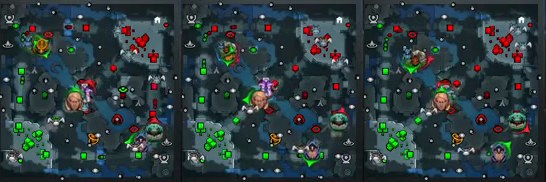
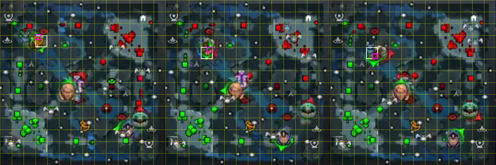
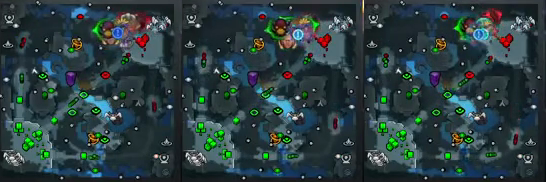
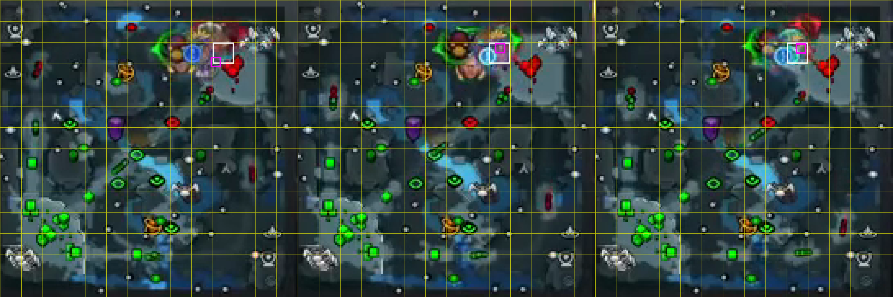

# Minimap evidence

These crops come directly from the task's 1280-by-720 `final.mp4`. The broadcast
minimap occupies pixels `(6, 537)` through `(187, 718)`, so its 182-pixel square
divides into fourteen exact 13-pixel cells. The source panels preserve the native
720p pixels. The grid panels enlarge them four times with nearest-neighbor sampling:
yellow lines are cell boundaries, the white box is the GT cell, and the magenta box
is centered on the replay-derived hero position.

`tools/build_minimap_evidence.py` rebuilds all four panels from the baked video and
the pinned replay positions:

```bash
python tools/build_minimap_evidence.py \
  --input /workspace/materials/final.mp4
```

## m1CKe death at 05:26

This early fight tests movement between neighboring cells while multiple icons
overlap. Left to right, the columns are 10 seconds before, 5 seconds before, and
the final live position.

| sample | HUD clock | GT cell |
|---|---:|---:|
| death minus 10 seconds | 05:16 | D11 |
| death minus 5 seconds | 05:21 | D10 |
| final live position | 05:26 | D10 |





## Nisha death at 44:56

This late-game sample is a dense high-ground teamfight. Several hero icons overlap
near the Dire base, but the tracked marker centers still resolve to a single cell.

| sample | HUD clock | GT cell |
|---|---:|---:|
| death minus 10 seconds | 44:46 | K12 |
| death minus 5 seconds | 44:51 | J12 |
| final live position | 44:56 | J12 |




