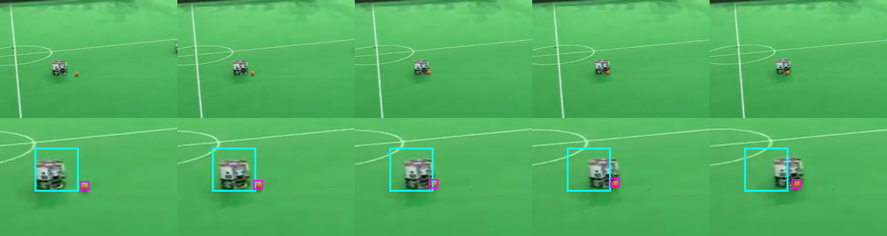
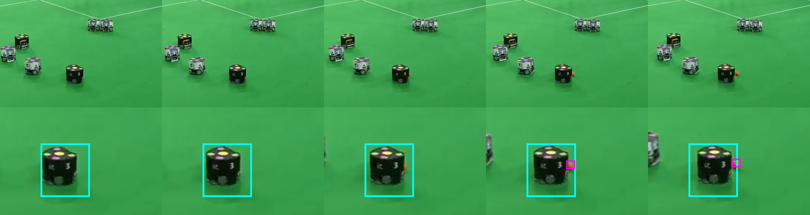
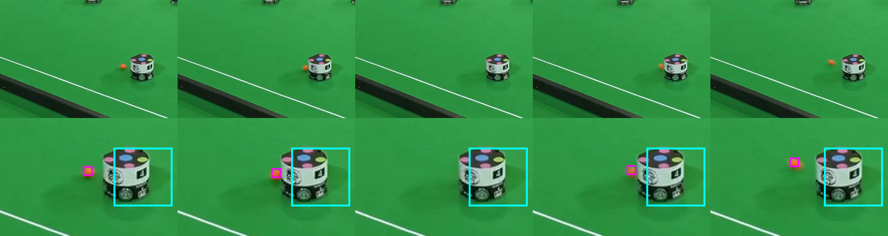
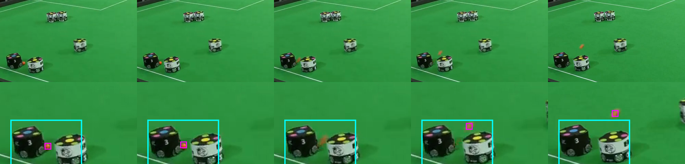

# Contact observability evidence

These panels come directly from the pinned 1280-by-720, 50-fps `match.mp4` whose
SHA256 is `076bcc59fc48443d24a72a87162021470b9e645b41c858c3ffa5b5b25bae36cd`.
Each panel shows five consecutive native frames from left to right. The upper row is
an unscaled crop of the 720p source. The lower row is a two-times nearest-neighbor
crop: cyan encloses the contacting robot or contact cluster and magenta encloses the
visible orange ball. A missing magenta box marks a frame in which the ball is
occluded by the robot at contact, not a missing source frame.

Global frame `F` has presentation time `F / 50` seconds. These panels are a reviewer
observability audit and are not copied into the agent workspace.

| panel | half | native frames | PTS range | visible evidence |
|---|---:|---:|---:|---|
| white midfield reversal | 1 | F8311-F8315 | 166.22-166.30 s | Ball approaches the white hull, reaches its mouth, then reverses direction. |
| black number 3 launch | 1 | F8764-F8768 | 175.28-175.36 s | Ball is occluded at black number 3's dribbler and then separates on a free trajectory. |
| white lower-field reversal | 1 | F10297-F10301 | 205.94-206.02 s | Ball approaches the white hull, is occluded for one frame, and departs in the opposite direction. |
| second-half cluster launch | 2 | F38096-F38100 | 761.92-762.00 s | Ball is visible at the robot cluster, occluded at contact, and then launches up-field. |









Rebuild the panels from the exact task media with:

```bash
python3 tools/build_contact_evidence.py \
  --input /workspace/materials/match.mp4
```

The generator rejects any input whose whole-file SHA256 differs from the pinned
task media. It contains every frame number, crop, robot box, and ball marker used
above. If review determines that redistributing these small derived crops is not
covered by the public source, they can move unchanged to the review evidence pack;
the script and source digest remain in the task.

Generated PNG SHA256 values:

```text
47becd8dc2bc51a4fc48c207080a976c005008bd07618fedb0ec530d610d862c  half1-black-number3-launch.png
61dbe7bb9c1389a335cae525dfd93bc3e985e209312e64876ed98b646b861235  half1-white-lower-field-reversal.png
30c622b3c16ccd256ad38671922a7c8566a4a4b651127137ac97233b6a6ee357  half1-white-midfield-reversal.png
493f352396e383d31922eb4f2c4c09e225fabccda326261799d54078539be65a  half2-cluster-launch.png
```
